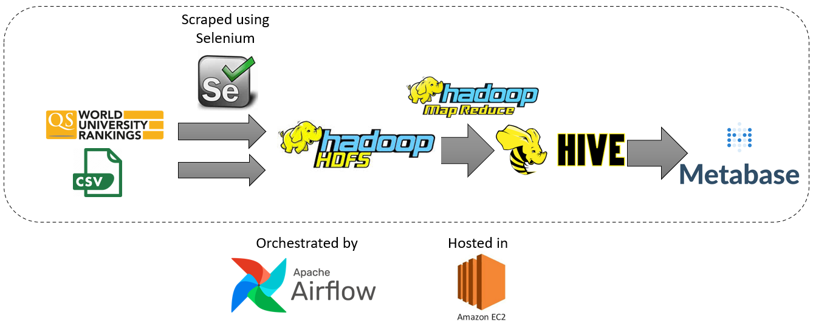

# QS-World-University-Ranking
## Purpose
This project aims to assists students in choosing universities from all over the world. With a huge amount of number of universities and their statistics, prospective student may be overwhelmed and potentialy may not make the optimal decision. Thus, this project hopes to simplify the decision making by visualizing the data in a dashboard.

## Architecture

Flow of data :
1. Data is scraped using Selenium from https://www.topuniversities.com/qs-world-university-rankings
2. Data is ingested to the data lake (In this case is Hadoop HDFS)
3. Data is transformed by mapreduce then ingested to the data warehouse (Hadoop Hive)
4. Data is then visualized using metabase in the EC 2
